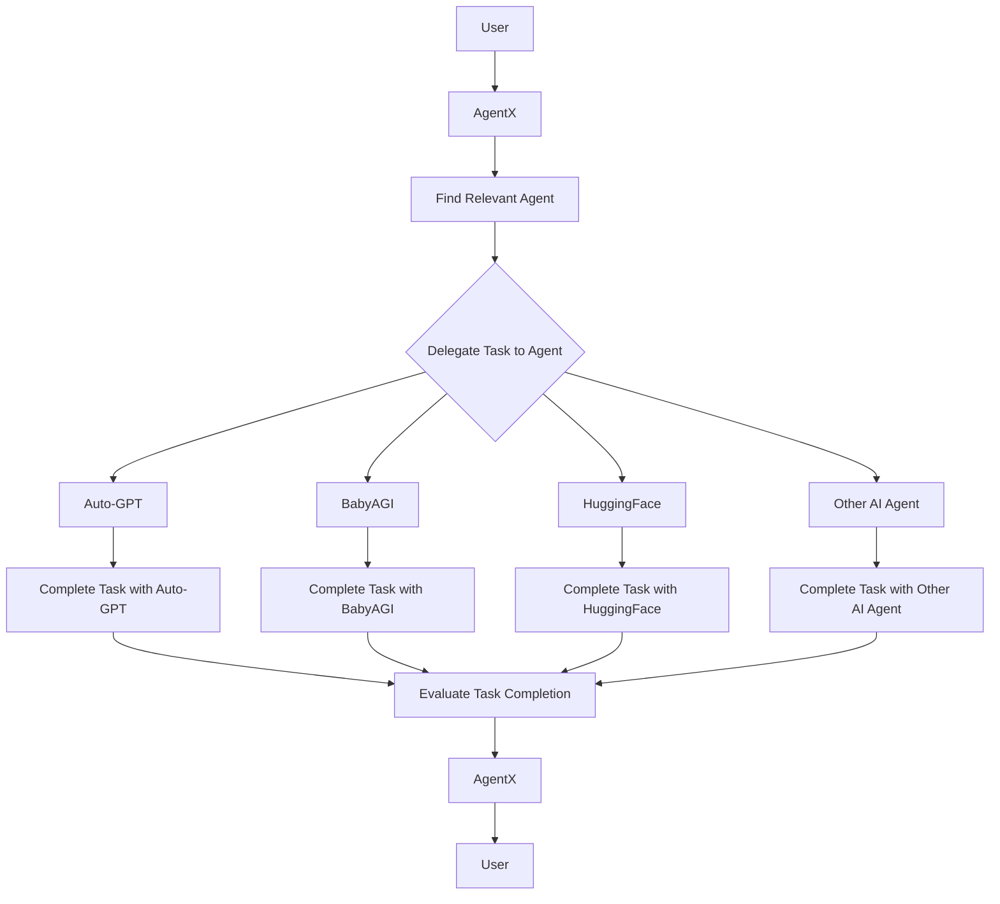

# AgentX

AgentX is a LangChain-powered agent that delegates tasks to multiple AI agents to efficiently handle complex tasks. It uses LangChain to communicate in parallel with Auto-GPT, babyagi, HuggingFace, and other AI agents to complete tasks.

## Overview

AgentX is a powerful tool that can help you handle complex tasks efficiently. By delegating tasks to multiple AI agents, AgentX can help you get more done in less time.

## How does AgentX work?

1. User requests assistance from AgentX.
2. AgentX retrieves necessary tools.
3. AgentX selects relevant tools.
4. Selected tools complete the task and their results are combined.
5. AgentX processes the combined results and presents the response to the user.

This user-AgentX interaction can be visualized as:



## LangChain

LangChain is an open-source library and framework that provides developers with tools to build applications powered by large language models (LLMs). It is specifically designed as an orchestration tool for prompts, making it easier for developers to chain different prompts interactively. LangChain can be used for various applications such as chatbots, generative question-answering, summarization, and more. It provides a standard interface for memory, a collection of memory implementations, and examples of chains/agents that use memory. LangChain is still in beta evaluation.

In AgentX, LangChain is used to communicate in parallel with multiple AI agents, enabling it to delegate tasks efficiently.

## Benefits of using AgentX

-  Delegates tasks to multiple AI agents for efficient handling of complex tasks.
-  Can handle a wide range of tasks, from answering questions to creating to-do lists.
-  Can be customized to suit your specific needs.

## Requirements

AgentX requires Python 3.8 and Poetry for package management. Here's how to install AgentX:

1. Clone this repository: `git clone git@github.com:slavakurilyak/agentx.git`
2. Install Poetry: `curl -sSL https://install.python-poetry.org | python3 -`
3. Set up the project: `poetry install`

## Usage

To use AgentX, activate the virtual environment:

```bash
source $(poetry env info --path)/bin/activate
```

Then run AgentX with the desired tool:

```bash
python agentx/baby_agi.py
python agentx/baby_agi_with_tools.py
python agentx/baby_agi_controller.py
```

Alternatively, you can use Poetry to run AgentX:

```bash
poetry run python agentx/baby_agi.py
poetry run python agentx/baby_agi_with_tools.py
poetry run python agentx/baby_agi_controller.py
```

### Tests

Make sure to always write meaningful test cases, when you develop new features or fix bugs.
Run tests in the projects root directory either via

```bash
pytest
```
when your virtual environment is enabled or otherwise
```bash
poetry run pytest
```


## Example Prompts

Try these prompts to test AgentX:

> Can you help me create a to-do list with some shopping items?

> Can you help me create a to-do list with some shopping items using some tools?

## .env.example

The .env.example file contains a template for your OpenAI API key. Copy this file to .env and add your API key to use AgentX with OpenAI.

```
OPENAI_API_KEY=
```

## Current Implementations

AgentX includes three implementations of the babyagi model:

-  `baby_agi.py` (207 lines of code) is a simpler version of babyagi that uses LangChain.
-  `baby_agi_with_tools.py` (220 lines of code) is a more advanced implementation of `baby_agi.py` that includes additional tools like search and todo.
-  `baby_agi_controller.py` (*WIP*) aims to combine `baby_agi.py` and `baby_agi_with_tools.py` to create the first implementation of AgentX.

## Limitations of AgentX

At present, AgentX is limited in its ability to interact with Auto-GPT and babyagi directly due to the following reasons:

-  These models do not currently have APIs available for interaction.
-  They also lack JSON manifest files such as `.well-known/ai-plugin.json` and `.well-known/openai.yaml`, which are required by OpenAI.

As a result of these limitations, AgentX can only interact with Auto-GPT and babyagi by directly cloning their source code using `$ git clone`. We will provide further information on these limitations shortly.

## Progress

-  [x] babyagi via LangChain
    - [x] `baby_agi.py`
    - [x] `baby_agi_with_tools.py`
    - [x] `baby_agi_controller.py` (*WIP*)
- [ ] Auto-GPT from source (see [issue](https://github.com/slavakurilyak/agentx/issues/1))
- [ ] babyagi from source (see [issue](https://github.com/slavakurilyak/agentx/issues/2))
- [ ] Teenage-AGI from source (see [issue](https://github.com/slavakurilyak/agentx/issues/3))

Sure, here's the section about contributions are welcome:

## Get involved

We appreciate your interest in AgentX! Here are some ways you can get involved:

-   If you like our project, please consider starring it on GitHub.
-   If you have an idea for a new feature or improvement, please open a new issue on GitHub.
-   If you see a bug or want to implement a feature, please open a new pull request on GitHub.
-   If you want to follow the founder on Twitter, visit [twitter.com/slavakurilyak](https://twitter.com/slavakurilyak).

Thank you for your support!

## Star History

[](https://star-history.com/#slavakurilyak/AgentX&Date)