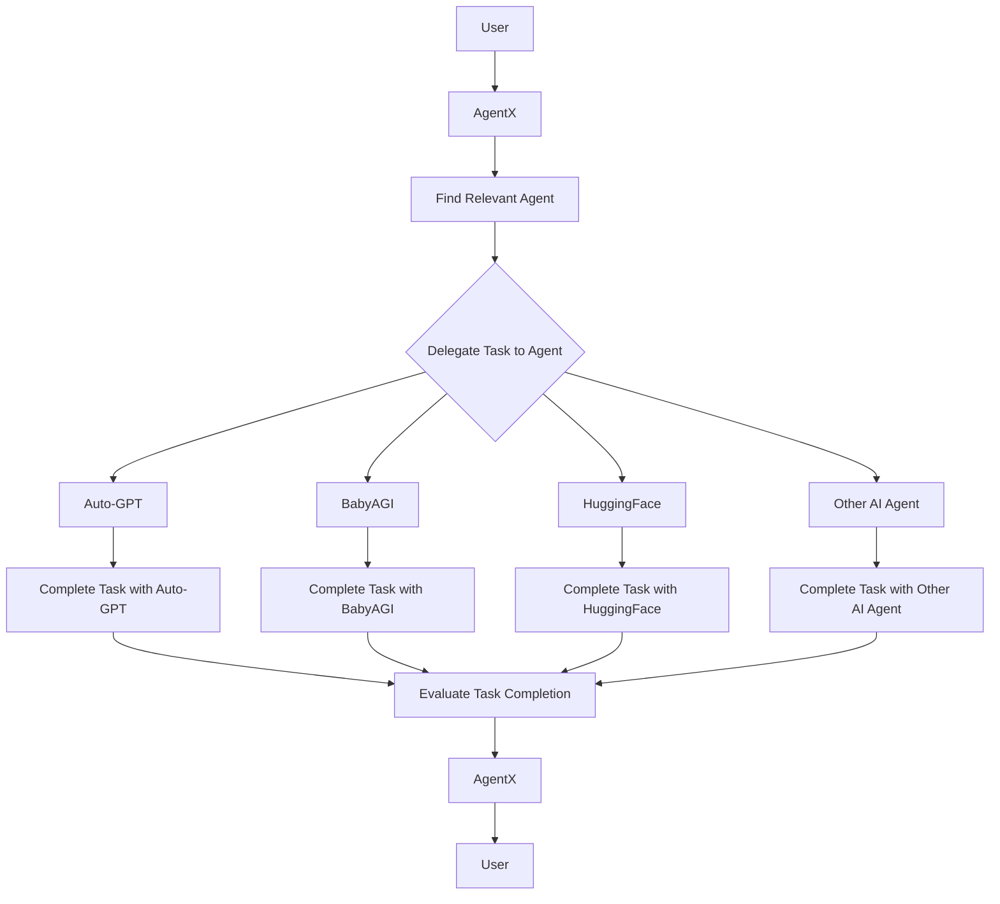

# AgentX

AgentX is an experiment to develop an autonomous agent that delegates well to Auto-GPT, babyagi, and other agents using LangChain. It is a LangChain-powered agent that delegates tasks to other AI agents until user's objective is complete. It aims to assist users in completing objectives using agent retrieval, whereby objectives are outsources to other AI agents (Auto-GPT, babyagi, HuggingFace) in parallel.

## Requirements

AgentX requires [Python 3.8](https://www.python.org/downloads/) and [Poetry](https://python-poetry.org/docs/#installation) for package management. 

## Set Up

Here's how to install AgentX:

1. Clone the repository:

```bash
git clone git@github.com:slavakurilyak/agentx.git
cd agentx
```
2. Set up the project and activate the virtual environment via Poetry:

```bash
poetry install
source $(poetry env info --path)/bin/activate
```

3. Copy `.env.example` to `.env`:

```bash
cp .env.example .env
```

4. Update your `OPENAI_API_KEY` and `SERPAPI_API_KEY` values inside newly created `.env`

## Usage

To run the 'experimental version' of AgentX using Python, type:

```bash
python agentx/agents/autogpt/main.py
python agentx/agents/babyagi/main.py
```

-or-

```bash
poetry run python agentx/agents/autogpt/main.py
poetry run python agentx/agents/babyagi/main.py
```

To run the 'stable version' of AgentX using Python, type:

```bash
python agentx/autogpt.py
python agentx/baby_agi_with_tools.py
python agentx/baby_agi_controller.py # WIP
```

-or-

```bash
poetry run python agentx/autogpt.py
poetry run python agentx/baby_agi_with_tools.py
poetry run python agentx/baby_agi_controller.py # WIP

```

### Contibuting

We use `black`, `isort` and `flake8` to ensure good code quality.

Always run the linters to check your code using:

```bash
isort --check .
black --check .
flake8
```

-or-

```bash
poetry run isort --check .
poetry run black --check .
poetry run flake8
```

To use `isort` and `black` for autoformatting, run the commands without the `--check` option using:

```bash
isort .
black .
flake8
```

-or-

```bash
poetry run isort .
poetry run black .
poetry run flake8
```

Run tests in the root directory either using:

```bash
pytest
```

-or-

```bash
poetry run pytest
```

## How does AgentX work?

1. User requests assistance from AgentX.
2. AgentX retrieves necessary tools.
3. AgentX selects relevant tools.
4. Selected tools complete the task and their results are combined.
5. AgentX processes the combined results and presents the response to the user.

This user-AgentX interaction can be visualized as:



## Benefits of using AgentX

-  Delegates tasks to multiple AI agents for efficient handling of complex tasks.
-  Can handle a wide range of tasks, from answering questions to creating to-do lists.
-  Can be customized to suit your specific needs.

## Limitations of AgentX

At present, AgentX is limited in its ability to interact with Auto-GPT and babyagi directly due to the following reasons:

-  These models do not currently have APIs available for interaction.
-  They also lack JSON manifest files such as `.well-known/ai-plugin.json` and `.well-known/openai.yaml`, which are required by OpenAI.

As a result of these limitations, AgentX can only interact with Auto-GPT and babyagi by directly cloning their source code using `$ git clone`. We will provide further information on these limitations shortly.

## Progress

- [x] BabyAGI using LangChain
- [x] Auto-GPT using LangChain
- [ ] Auto-GPT from source (see [issue](https://github.com/slavakurilyak/agentx/issues/1))
- [ ] babyagi from source (see [issue](https://github.com/slavakurilyak/agentx/issues/2))
- [ ] Teenage-AGI from source (see [issue](https://github.com/slavakurilyak/agentx/issues/3))

Sure, here's the section about contributions are welcome:

## Get involved

We appreciate your interest in AgentX! Here are some ways you can get involved:

-   If you like our project, please consider starring it on GitHub.
-   If you have an idea for a new feature or improvement, please open a new issue on GitHub.
-   If you see a bug or want to implement a feature, please open a new pull request on GitHub.
-   If you want to follow the founder on Twitter, visit [twitter.com/slavakurilyak](https://twitter.com/slavakurilyak).

Thank you for your support!

## Star History

[](https://star-history.com/#slavakurilyak/AgentX&Date)