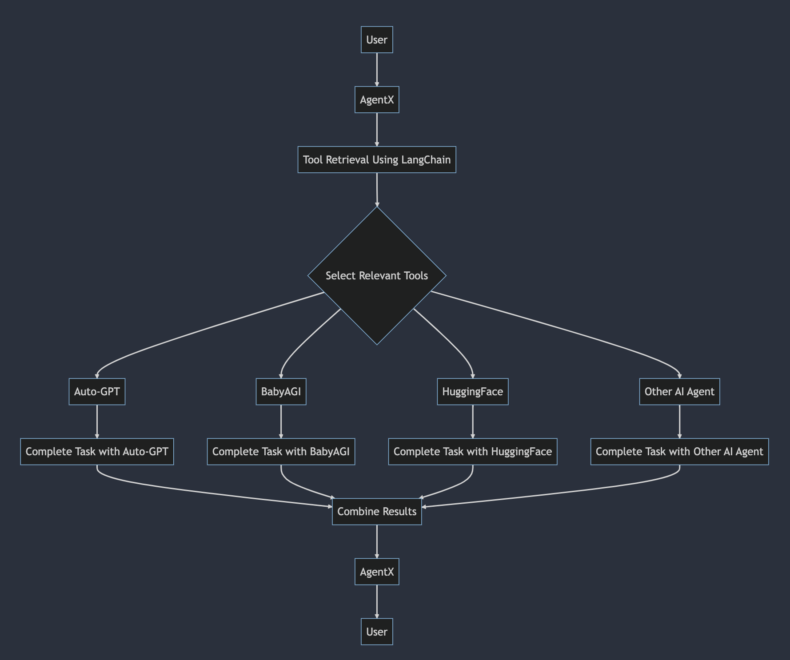

# AgentX

AgentX is an AI controller that relies on three LLM chains to perform tasks. The code for AgentX was inspired by [this example](https://python.langchain.com/en/latest/use_cases/agents/baby_agi.html) and [this repository](https://github.com/yoheinakajima/babyagi/tree/main).

## Proposed Architecture

1.  A user interacts with AgentX, requesting assistance with a task.
2.  AgentX processes the request and retrieves the necessary tools to help with the task.
3.  AgentX selects the relevant tools from the available options: Auto-GPT, BabyAGI, HuggingFace, and Other AI Agent.
4.  Each selected tool is then used to complete the task:
    -   Auto-GPT completes the task using its capabilities.
    -   BabyAGI completes the task using its capabilities.
    -   HuggingFace completes the task using its capabilities.
    -   Other AI Agent completes the task using its capabilities.
5.  The results from each tool are combined into a coherent and comprehensive output.
6.  AgentX receives the combined results and processes them to provide the best response.
7.  Finally, AgentX presents the response to the user.



AgentX flowchart generated using Mermaid.js

## Installation

1. Clone this repository
2. Create a Python 3.8 virtual environment: `python3.8 -m venv .venv`
3. Activate the virtual environment: `source .venv/bin/activate`
4. Copy `.env.example` to create `.env`.
5. Set your OpenAI API key in `.env`.
6. Install the required modules by running `pip install -r requirements.txt`.

## Usage

To run the AgentX controller, run the following command with the virtual environment activated:

```
python main.py
```

This will start the AgentX controller and run it until it completes all tasks or until it reaches the maximum number of iterations.

## Requirements

The following modules are required and can be installed using the command `pip install -r requirements.txt`:

```
langchain
openai
pydantic
faiss-cpu
tiktoken
```

## .env.example

```
OPENAI_API_KEY=
```